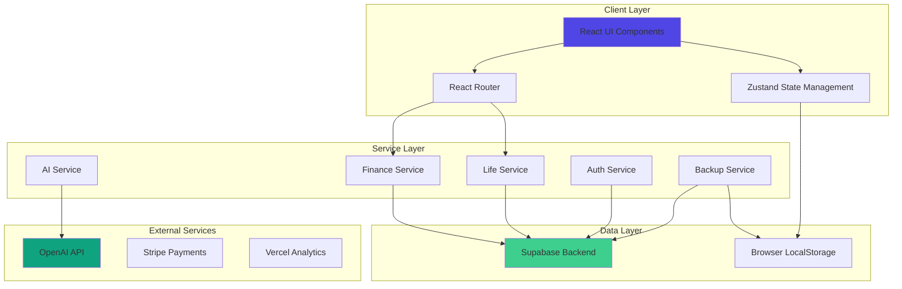
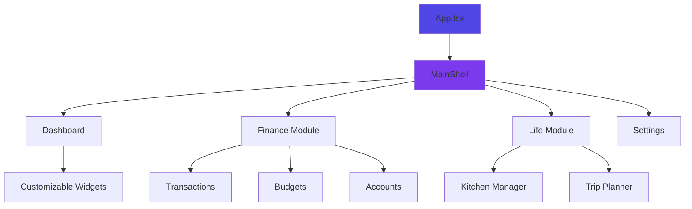
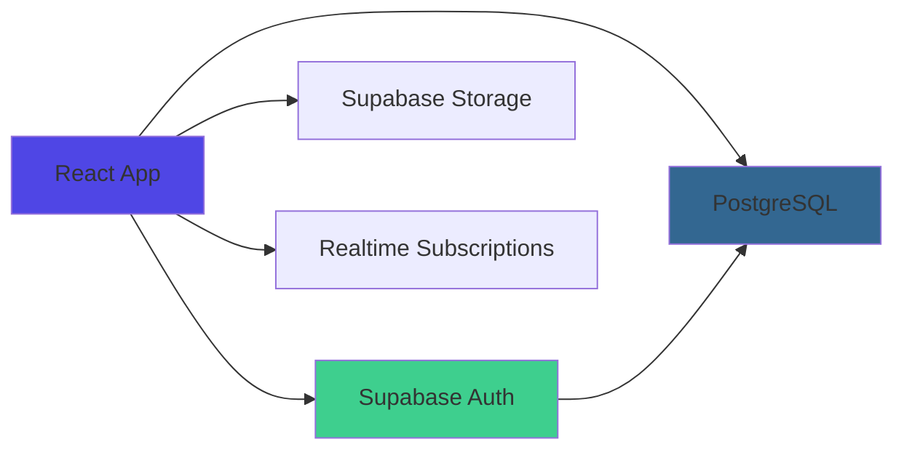
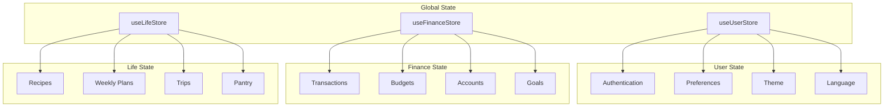
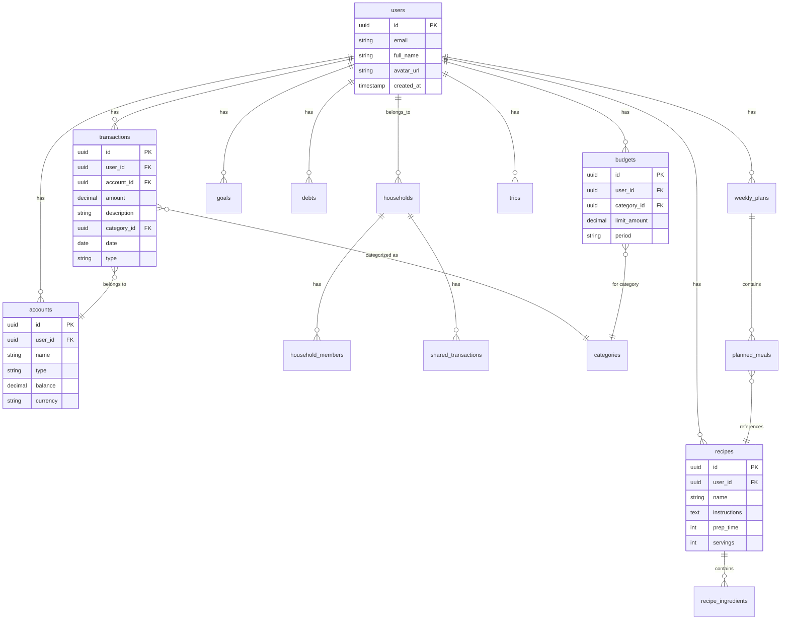
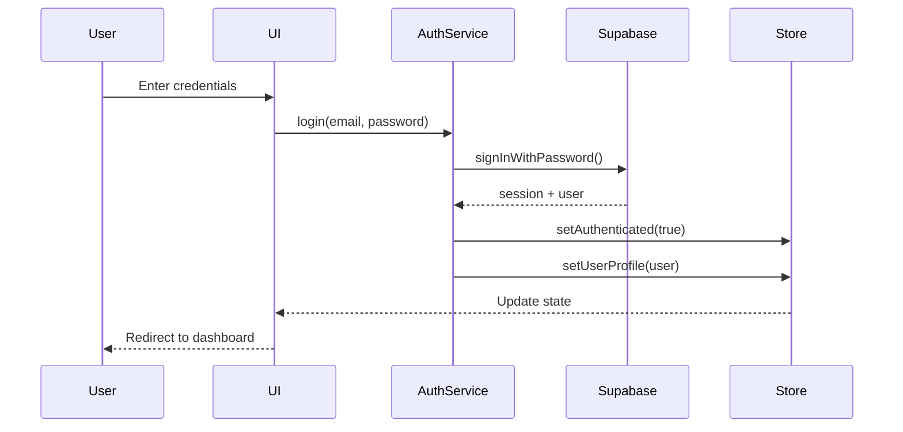
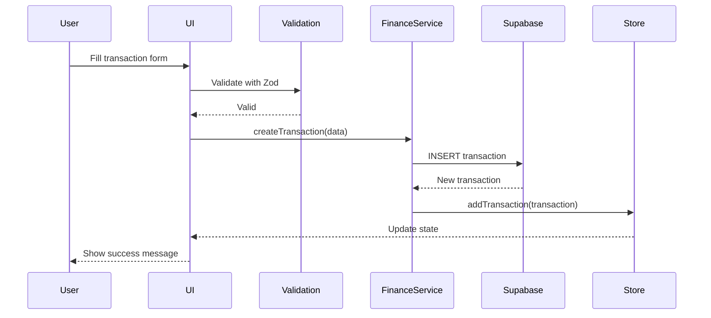
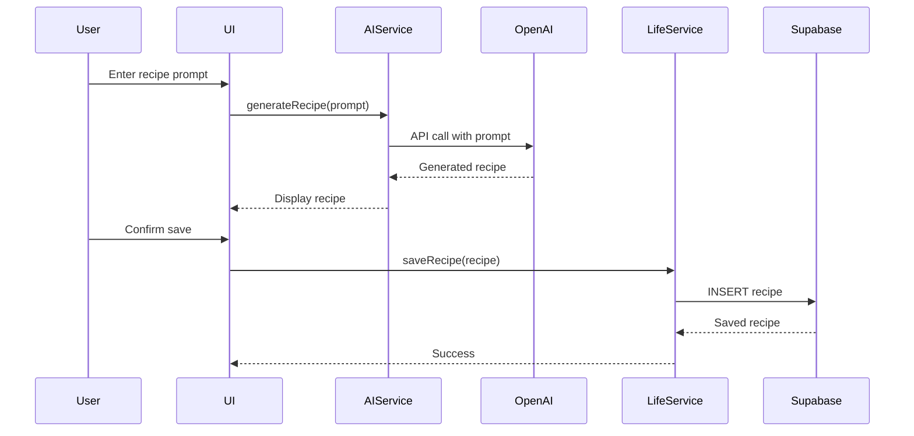
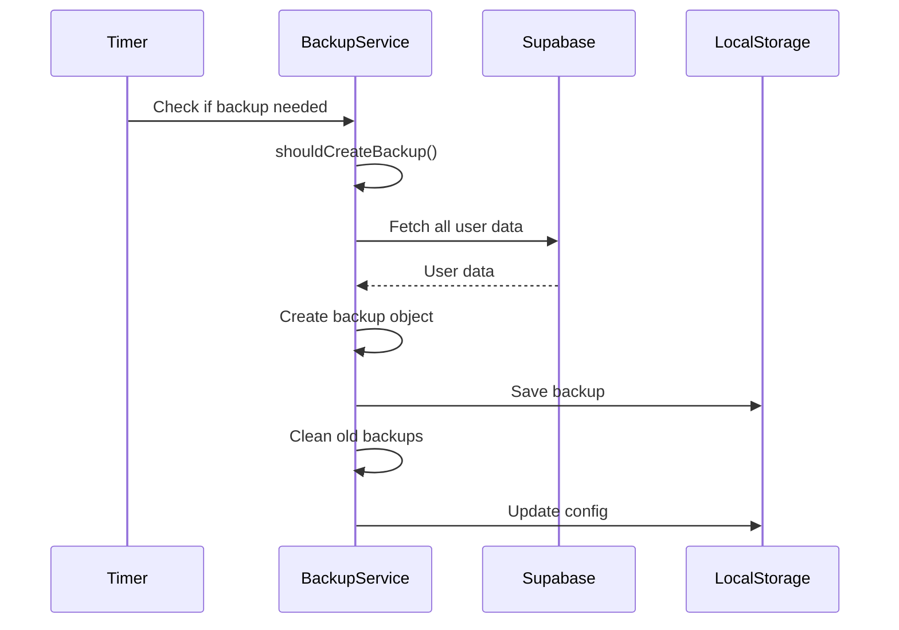
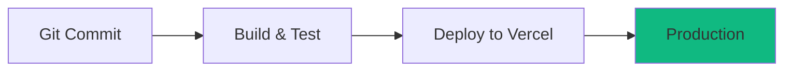

# 🏗️ Onyx Suite 2026 - Documentación de Arquitectura

**Versión 1.0** | Última actualización: Febrero 2026

---

## 📋 Tabla de Contenidos

1. [Visión General del Sistema](#visión-general-del-sistema)
2. [Arquitectura de Alto Nivel](#arquitectura-de-alto-nivel)
3. [Stack Tecnológico](#stack-tecnológico)
4. [Arquitectura Frontend](#arquitectura-frontend)
5. [Arquitectura Backend](#arquitectura-backend)
6. [Gestión de Estado](#gestión-de-estado)
7. [Base de Datos](#base-de-datos)
8. [Servicios y APIs](#servicios-y-apis)
9. [Flujos de Datos](#flujos-de-datos)
10. [Seguridad](#seguridad)
11. [Patrones de Diseño](#patrones-de-diseño)

---

## 🎯 Visión General del Sistema

Onyx Suite 2026 es una aplicación web progresiva (PWA) construida con React y TypeScript que integra gestión financiera personal y gestión del hogar en una plataforma unificada.

### Objetivos Arquitectónicos

- **Modularidad**: Componentes reutilizables y desacoplados
- **Escalabilidad**: Arquitectura preparada para crecimiento
- **Performance**: Optimización de carga y renderizado
- **Seguridad**: Protección de datos sensibles
- **Mantenibilidad**: Código limpio y bien documentado
- **Accesibilidad**: Cumplimiento WCAG 2.1 AA

---

## 🏛️ Arquitectura de Alto Nivel



---

## 💻 Stack Tecnológico

### Frontend

| Tecnología | Versión | Propósito |
|------------|---------|-----------|
| **React** | 18.3.1 | UI Framework |
| **TypeScript** | 5.x | Type Safety |
| **Vite** | 5.x | Build Tool |
| **TailwindCSS** | 3.x | Styling |
| **Zustand** | 4.x | State Management |
| **React Router** | 6.x | Routing |
| **React Grid Layout** | 1.x | Dashboard Layouts |
| **Lucide React** | Latest | Icons |
| **Recharts** | 2.x | Data Visualization |

### Backend & Services

| Tecnología | Propósito |
|------------|-----------|
| **Supabase** | Backend as a Service (BaaS) |
| **PostgreSQL** | Database (via Supabase) |
| **Supabase Auth** | Authentication |
| **Supabase Storage** | File Storage |
| **OpenAI API** | AI Features |
| **Stripe** | Payment Processing |

### DevOps & Tools

| Tecnología | Propósito |
|------------|-----------|
| **Vercel** | Hosting & Deployment |
| **GitHub** | Version Control |
| **Vitest** | Unit Testing |
| **ESLint** | Code Linting |
| **Prettier** | Code Formatting |
| **Zod** | Schema Validation |

---

## 🎨 Arquitectura Frontend

### Estructura de Carpetas

```
src/
├── components/           # React Components
│   ├── common/          # Shared components
│   ├── dashboard/       # Dashboard widgets
│   ├── features/        # Feature-specific components
│   │   ├── finance/    # Finance module
│   │   ├── life/       # Life module
│   │   ├── settings/   # Settings
│   │   └── collaboration/ # Family features
│   ├── layout/         # Layout components
│   └── pages/          # Page components
├── hooks/              # Custom React hooks
├── services/           # API & Business Logic
├── store/              # Zustand stores
├── types/              # TypeScript types
├── utils/              # Utility functions
├── schemas/            # Zod validation schemas
├── constants/          # App constants
└── data/               # Static data
```

### Componentes Principales



### Patrón de Componentes

Todos los componentes siguen este patrón:

```typescript
// 1. Imports
import React from 'react';
import { useStore } from '../store/useStore';

// 2. Types/Interfaces
interface ComponentProps {
    prop1: string;
    prop2?: number;
}

// 3. Component
export const Component: React.FC<ComponentProps> = ({ prop1, prop2 }) => {
    // 4. Hooks
    const { data } = useStore();
    const [state, setState] = useState();
    
    // 5. Effects
    useEffect(() => {
        // Side effects
    }, []);
    
    // 6. Handlers
    const handleAction = () => {
        // Logic
    };
    
    // 7. Render
    return (
        <div>
            {/* JSX */}
        </div>
    );
};
```

---

## 🔧 Arquitectura Backend

### Supabase como BaaS

Onyx Suite utiliza Supabase como backend completo:



### Servicios

#### AuthService
- Registro de usuarios
- Login/Logout
- Recuperación de contraseña
- Gestión de sesiones

#### FinanceService
- CRUD de transacciones
- Gestión de presupuestos
- Cálculos financieros
- Importación CSV

#### LifeService
- Gestión de recetas
- Planificación de comidas
- Gestión de viajes
- Inventario de despensa

#### AIService
- Generación de recetas
- Categorización automática
- Análisis predictivo
- Recomendaciones personalizadas

#### BackupService
- Creación de backups
- Restauración de datos
- Gestión de retención
- Exportación de datos

---

## 📊 Gestión de Estado

### Zustand Stores



### useUserStore

```typescript
interface UserState {
    // Authentication
    isAuthenticated: boolean;
    userProfile: UserProfile | null;
    
    // Preferences
    language: Language;
    currency: Currency;
    theme: Theme;
    
    // Dashboard
    dashboardLayouts: DashboardLayout[];
    activeLayoutId: string;
    
    // Privacy
    cookiePreferences: CookiePreferences;
    aiPreferences: AIPreferences;
}
```

### useFinanceStore

```typescript
interface FinanceState {
    transactions: Transaction[];
    budgets: Budget[];
    accounts: Account[];
    goals: Goal[];
    debts: Debt[];
    
    // Computed
    totalBalance: number;
    monthlyIncome: number;
    monthlyExpenses: number;
}
```

### useLifeStore

```typescript
interface LifeState {
    recipes: Recipe[];
    weeklyPlans: WeeklyPlan[];
    trips: Trip[];
    pantryItems: PantryItem[];
    shoppingLists: ShoppingList[];
}
```

---

## 🗄️ Base de Datos

### Esquema de Base de Datos



### Tablas Principales

#### users
Almacena información de usuarios (gestionada por Supabase Auth)

#### transactions
Registro de todas las transacciones financieras

#### budgets
Presupuestos definidos por categoría

#### accounts
Cuentas bancarias del usuario

#### goals
Metas de ahorro

#### debts
Deudas y préstamos

#### recipes
Recetas de cocina

#### weekly_plans
Planes semanales de comidas

#### trips
Viajes planificados

#### households
Hogares familiares para colaboración

#### household_members
Miembros de cada hogar con roles

---

## 🔌 Servicios y APIs

### API Endpoints (Supabase)

#### Authentication
```
POST /auth/signup
POST /auth/login
POST /auth/logout
POST /auth/reset-password
```

#### Transactions
```
GET    /transactions
POST   /transactions
PUT    /transactions/:id
DELETE /transactions/:id
GET    /transactions/stats
```

#### Budgets
```
GET    /budgets
POST   /budgets
PUT    /budgets/:id
DELETE /budgets/:id
GET    /budgets/progress
```

#### Recipes
```
GET    /recipes
POST   /recipes
PUT    /recipes/:id
DELETE /recipes/:id
POST   /recipes/generate-ai
```

### Integración con OpenAI

```typescript
// AI Service Architecture
interface AIServiceConfig {
    apiKey: string;
    model: 'gpt-4' | 'gpt-3.5-turbo';
    temperature: number;
}

class AIService {
    async generateRecipe(prompt: string): Promise<Recipe>
    async categorizeTransaction(description: string): Promise<Category>
    async analyzePredictive(data: FinancialData): Promise<Insights>
    async generateRecommendations(context: UserContext): Promise<Recommendation[]>
}
```

### Integración con Stripe

```typescript
// Payment Service
interface StripeConfig {
    publishableKey: string;
    secretKey: string;
}

class StripeService {
    async createCheckoutSession(plan: Plan): Promise<Session>
    async createPortalSession(customerId: string): Promise<Session>
    async handleWebhook(event: StripeEvent): Promise<void>
}
```

---

## 🔄 Flujos de Datos

### Flujo de Autenticación



### Flujo de Creación de Transacción



### Flujo de Generación de Receta con IA



### Flujo de Backup Automático



---

## 🔒 Seguridad

### Autenticación y Autorización

#### Row Level Security (RLS)

Todas las tablas de Supabase tienen RLS habilitado:

```sql
-- Example: Transactions table
CREATE POLICY "Users can only see their own transactions"
ON transactions
FOR SELECT
USING (auth.uid() = user_id);

CREATE POLICY "Users can only insert their own transactions"
ON transactions
FOR INSERT
WITH CHECK (auth.uid() = user_id);
```

#### JWT Tokens

- Tokens firmados por Supabase
- Expiración de 1 hora
- Refresh tokens para renovación automática
- Almacenados en httpOnly cookies

### Protección de Datos

#### Encriptación

- **En tránsito**: HTTPS/TLS 1.3
- **En reposo**: Encriptación AES-256 (Supabase)
- **Contraseñas**: Bcrypt con salt

#### Validación de Datos

```typescript
// Zod schemas para validación
const transactionSchema = z.object({
    amount: z.number().positive(),
    description: z.string().min(1).max(200),
    category_id: z.string().uuid(),
    date: z.string().datetime(),
    type: z.enum(['INCOME', 'EXPENSE'])
});
```

### GDPR Compliance

- **Consentimiento de cookies**: Cookie banner con preferencias
- **Derecho al olvido**: Eliminación de cuenta con período de gracia
- **Portabilidad de datos**: Exportación completa en JSON
- **Transparencia**: Política de privacidad clara

### Manejo de Errores

```typescript
// Error Boundary para capturar errores de React
class ErrorBoundary extends React.Component {
    componentDidCatch(error: Error, errorInfo: ErrorInfo) {
        // Log to monitoring service
        logger.error(error, errorInfo);
    }
}

// Global error handler
window.addEventListener('error', (event) => {
    logger.error(event.error);
});
```

---

## 🎨 Patrones de Diseño

### Component Patterns

#### Compound Components

```typescript
<Dropdown>
    <Dropdown.Trigger>Open Menu</Dropdown.Trigger>
    <Dropdown.Menu>
        <Dropdown.Item>Option 1</Dropdown.Item>
        <Dropdown.Item>Option 2</Dropdown.Item>
    </Dropdown.Menu>
</Dropdown>
```

#### Render Props

```typescript
<DataFetcher
    url="/api/transactions"
    render={({ data, loading, error }) => (
        loading ? <Spinner /> : <TransactionList data={data} />
    )}
/>
```

#### Custom Hooks

```typescript
// Reusable logic extraction
const useTransactions = (filters: Filters) => {
    const [transactions, setTransactions] = useState([]);
    const [loading, setLoading] = useState(true);
    
    useEffect(() => {
        fetchTransactions(filters).then(setTransactions);
    }, [filters]);
    
    return { transactions, loading };
};
```

### State Management Patterns

#### Flux Pattern (via Zustand)

```typescript
// Actions modify state immutably
const useStore = create((set) => ({
    count: 0,
    increment: () => set((state) => ({ count: state.count + 1 })),
    decrement: () => set((state) => ({ count: state.count - 1 }))
}));
```

#### Optimistic Updates

```typescript
// Update UI immediately, rollback on error
const updateTransaction = async (id, data) => {
    const previous = store.getState().transactions;
    
    // Optimistic update
    store.setState({ transactions: updated });
    
    try {
        await api.update(id, data);
    } catch (error) {
        // Rollback
        store.setState({ transactions: previous });
    }
};
```

### Service Layer Pattern

```typescript
// Separation of concerns
class TransactionService {
    private api: SupabaseClient;
    
    async getAll(userId: string): Promise<Transaction[]> {
        const { data } = await this.api
            .from('transactions')
            .select('*')
            .eq('user_id', userId);
        return data;
    }
    
    async create(transaction: NewTransaction): Promise<Transaction> {
        const { data } = await this.api
            .from('transactions')
            .insert(transaction)
            .single();
        return data;
    }
}
```

### Repository Pattern

```typescript
// Abstract data access
interface ITransactionRepository {
    findAll(userId: string): Promise<Transaction[]>;
    findById(id: string): Promise<Transaction | null>;
    create(transaction: NewTransaction): Promise<Transaction>;
    update(id: string, data: Partial<Transaction>): Promise<Transaction>;
    delete(id: string): Promise<void>;
}

class SupabaseTransactionRepository implements ITransactionRepository {
    // Implementation
}
```

---

## 📈 Performance

### Optimizaciones

#### Code Splitting

```typescript
// Lazy loading de rutas
const Finance = lazy(() => import('./pages/Finance'));
const Life = lazy(() => import('./pages/Life'));

<Suspense fallback={<Loading />}>
    <Routes>
        <Route path="/finance" element={<Finance />} />
        <Route path="/life" element={<Life />} />
    </Routes>
</Suspense>
```

#### Memoization

```typescript
// Evitar re-renders innecesarios
const MemoizedComponent = React.memo(({ data }) => {
    return <ExpensiveComponent data={data} />;
});

// Memoizar cálculos costosos
const total = useMemo(() => {
    return transactions.reduce((sum, t) => sum + t.amount, 0);
}, [transactions]);
```

#### Virtual Scrolling

```typescript
// Para listas largas
import { FixedSizeList } from 'react-window';

<FixedSizeList
    height={600}
    itemCount={transactions.length}
    itemSize={50}
>
    {({ index, style }) => (
        <TransactionRow
            transaction={transactions[index]}
            style={style}
        />
    )}
</FixedSizeList>
```

### Métricas

- **First Contentful Paint (FCP)**: < 1.5s
- **Largest Contentful Paint (LCP)**: < 2.5s
- **Time to Interactive (TTI)**: < 3.5s
- **Cumulative Layout Shift (CLS)**: < 0.1

---

## 🚀 Deployment

### CI/CD Pipeline



### Ambientes

- **Development**: Local (localhost:5173)
- **Staging**: Vercel Preview Deployments
- **Production**: onyx-suite.vercel.app

### Variables de Entorno

```env
VITE_SUPABASE_URL=https://xxx.supabase.co
VITE_SUPABASE_ANON_KEY=xxx
VITE_OPENAI_API_KEY=xxx
VITE_STRIPE_PUBLISHABLE_KEY=xxx
```

---

## 📚 Referencias

### Documentación Externa

- [React Documentation](https://react.dev)
- [TypeScript Handbook](https://www.typescriptlang.org/docs/)
- [Supabase Documentation](https://supabase.com/docs)
- [Zustand Documentation](https://docs.pmnd.rs/zustand)
- [TailwindCSS Documentation](https://tailwindcss.com/docs)

### Recursos Internos

- [USER_GUIDE.md](./USER_GUIDE.md) - Manual de usuario
- [API.md](./API.md) - Documentación de API (próximamente)
- [CONTRIBUTING.md](./CONTRIBUTING.md) - Guía de contribución

---

*Onyx Suite 2026 - Arquitectura robusta para tu vida organizada.*
